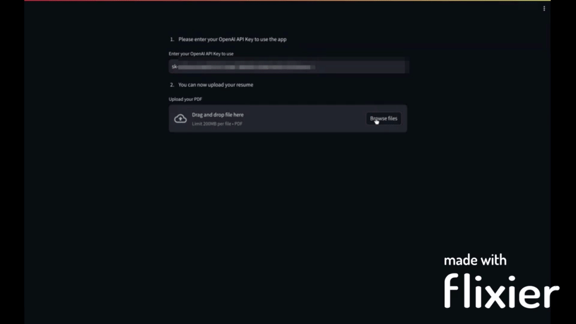

# Welcome to Upwork'd.AI
### Making your Freelance Job Search Instantaneous!!!

> ### Feature:
> - Job Fitness Score
> - Expected Salary
> - Cover Letter
> - Experience Gaps 
> - Day to Day Activity

## Quick Start
1. Enter OpenAI API Token
2. Upload Resume
3. Enter Job Description (hit enter)

### Example

### For more of my work see [My Portfolio](https://generative-ai-portfolio-daukgnhrbwu5cugphlvjmm.streamlit.app/)

 
&nbsp;
&nbsp;
&nbsp;  

&nbsp;
&nbsp;
&nbsp;  

